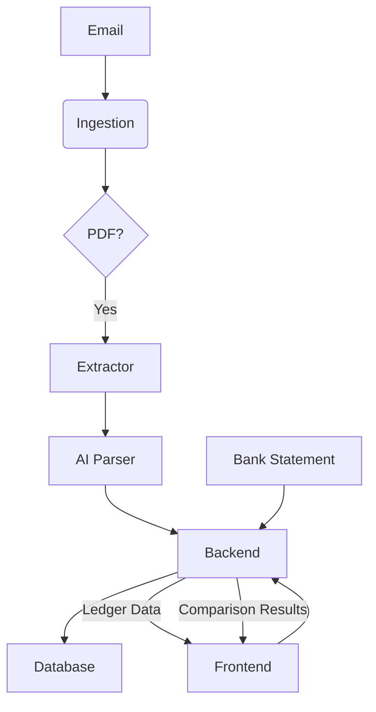

# Minerva Coding Challenge - Complete Development Guide

## Project Overview

This document provides a comprehensive guide to build a full-stack receipt processing system for the Minerva coding challenge. The system will demonstrate expertise in the company's tech stack while showcasing strong UX design, customer empathy, and technical innovation.

### Challenge Requirements

Build a system that:
1. Reads incoming emails and checks for attached PDF receipts
2. Parses the receipts and stores details in a database table called "ledger"
3. Shows the ledger in a simple user interface
4. Allows uploading bank statement CSV with transactions
5. Compares bank transactions with the ledger
6. Displays a clear table showing:
   - Transactions that match
   - Transactions only in the ledger
   - Transactions only in the bank statement

### Success Criteria
- Quality of work directly influences compensation package
- Speed of execution is a key evaluation criterion
- Must be hosted on Vercel
- Submission deadline: End of this week
- Use of AI coding tools is highly encouraged

## Company Tech Stack Alignment

**Frontend:**
- Next.js with TypeScript
- Tailwind CSS for styling
- shadcn/ui for components

**Backend:**
- Node.js with tRPC
- Prisma ORM
- Database (we'll use PostgreSQL for development, easily adaptable to MS SQL Server)

**AI Integration:**
- OpenAI GPT-4o for receipt parsing
- Potential for RAG implementation

**Infrastructure:**
- Vercel for deployment
- GitHub for version control

## Project Structure and Requirements Analysis

### Core Features Analysis

1. **Email Processing System**
   - Email integration (Gmail API or similar)
   - PDF attachment detection and extraction
   - Automated processing pipeline

2. **Receipt Parsing Engine**
   - AI-powered OCR and data extraction
   - Structured data extraction (vendor, amount, date, category)
   - Error handling and validation

3. **Database Design**
   - Ledger table with proper schema
   - Transaction matching logic
   - Data integrity and relationships

4. **User Interface**
   - Clean, intuitive dashboard
   - Ledger display with filtering/sorting
   - Bank statement upload functionality
   - Transaction comparison view

5. **Bank Statement Processing**
   - CSV parsing and validation
   - Transaction standardization
   - Matching algorithm implementation

6. **Comparison Engine**
   - Intelligent matching logic
   - Discrepancy identification
   - Clear visualization of results


## System Architecture Design

### High-Level Architecture

The system will follow a modular, full-stack architecture, leveraging the specified tech stack for scalability and maintainability.



### Component Breakdown

1.  **Email Service:** Responsible for connecting to an email provider (e.g., Gmail API, custom IMAP server) to read incoming emails. It will filter emails for specific subjects or senders and identify attachments.
2.  **PDF Extractor:** Extracts PDF files from identified email attachments. This component will handle file storage temporarily before parsing.
3.  **AI Receipt Parser:** Utilizes OpenAI GPT-4o for intelligent data extraction from PDF receipts. This involves:
    *   **OCR (Optical Character Recognition):** To convert image-based text in PDFs into machine-readable text.
    *   **Natural Language Processing (NLP):** To identify key entities like vendor name, date, total amount, line items, and categories.
    *   **Data Validation:** Basic checks to ensure extracted data conforms to expected formats.
4.  **Backend API (Node.js/tRPC):** The central hub for business logic. It will expose endpoints for:
    *   Receiving parsed receipt data from the AI parser.
    *   Storing and retrieving ledger entries.
    *   Handling bank statement uploads.
    *   Performing transaction comparisons.
    *   Serving data to the frontend.
5.  **Database (Prisma/PostgreSQL):** The persistent storage layer. Prisma will be used as the ORM for type-safe database interactions. PostgreSQL is chosen for development due to its robustness and ease of setup, with a clear path to migrate to MS SQL Server as required.
6.  **Frontend (Next.js/TypeScript/Tailwind CSS/shadcn/ui):** The user-facing application providing:
    *   A dashboard to view the ledger.
    *   An interface for uploading bank statements.
    *   A dedicated view for displaying transaction comparison results.
    *   Responsive design for optimal UX.

## Database Schema Design

We will define two primary tables: `LedgerEntry` and `BankTransaction`. The `ComparisonResult` will be a derived view or handled in the application logic.

### `LedgerEntry` Table

This table will store details extracted from PDF receipts.

| Field Name      | Data Type | Description                                  | Constraints       |
| :-------------- | :-------- | :------------------------------------------- | :---------------- |
| `id`            | `String`  | Unique identifier for the ledger entry       | `UUID`, `PK`      |
| `vendor`        | `String`  | Name of the vendor                           | `NOT NULL`        |
| `amount`        | `Decimal` | Transaction amount                           | `NOT NULL`        |
| `currency`      | `String`  | Currency of the transaction (e.g., USD, EUR) | `DEFAULT 'USD'`   |
| `transactionDate` | `DateTime`| Date of the transaction                      | `NOT NULL`        |
| `category`      | `String`  | Categorization of the expense                | `NULLABLE`        |
| `description`   | `String`  | Optional description from the receipt        | `NULLABLE`        |
| `receiptUrl`    | `String`  | URL or path to the original PDF receipt      | `NULLABLE`        |
| `createdAt`     | `DateTime`| Timestamp of record creation                 | `DEFAULT NOW()`   |
| `updatedAt`     | `DateTime`| Timestamp of last update                     | `DEFAULT NOW()`   |

### `BankTransaction` Table

This table will temporarily store transactions uploaded from bank statements.

| Field Name      | Data Type | Description                                  | Constraints       |
| :-------------- | :-------- | :------------------------------------------- | :---------------- |
| `id`            | `String`  | Unique identifier for the bank transaction   | `UUID`, `PK`      |
| `description`   | `String`  | Description from the bank statement          | `NOT NULL`        |
| `amount`        | `Decimal` | Transaction amount                           | `NOT NULL`        |
| `transactionDate` | `DateTime`| Date of the transaction                      | `NOT NULL`        |
| `type`          | `String`  | Type of transaction (e.g., DEBIT, CREDIT)    | `NULLABLE`        |
| `sourceFile`    | `String`  | Name of the CSV file it originated from      | `NULLABLE`        |
| `createdAt`     | `DateTime`| Timestamp of record creation                 | `DEFAULT NOW()`   |

### Prisma Schema (`schema.prisma`)

```prisma
generator client {
  provider = "prisma-client-js"
}

datasource db {
  provider = "postgresql"
  url      = env("DATABASE_URL")
}

model LedgerEntry {
  id              String    @id @default(uuid())
  vendor          String
  amount          Decimal   @db.Decimal(10, 2)
  currency        String    @default("USD")
  transactionDate DateTime  @map("transaction_date") @db.Date
  category        String? // Optional category
  description     String? // Optional description from receipt
  receiptUrl      String? // URL or path to the original PDF receipt
  createdAt       DateTime  @default(now()) @map("created_at")
  updatedAt       DateTime  @updatedAt @map("updated_at")

  @@map("ledger_entries")
}

model BankTransaction {
  id              String    @id @default(uuid())
  description     String
  amount          Decimal   @db.Decimal(10, 2)
  transactionDate DateTime  @map("transaction_date") @db.Date
  type            String? // e.g., DEBIT, CREDIT
  sourceFile      String? // Name of the CSV file it originated from
  createdAt       DateTime  @default(now()) @map("created_at")

  @@map("bank_transactions")
}
```

**Note on `db.Date`:** For `transactionDate`, we use `@db.Date` to store only the date part without time, which is typically sufficient for financial transactions and simplifies matching.

### Transaction Matching Logic

Matching will primarily occur based on `amount` and `transactionDate`. A tolerance for `amount` (e.g., +/- a small percentage) and `transactionDate` (e.g., +/- 1-3 days) can be introduced to account for minor discrepancies.

**Matching Criteria (Prioritized):**
1.  **Exact Match:** `amount` and `transactionDate` (within tolerance) are identical.
2.  **Partial Match:** `amount` and `transactionDate` are close, and `description`/`vendor` contain similar keywords.

**Comparison Categories:**
*   **Matched Transactions:** Entries found in both `LedgerEntry` and `BankTransaction`.
*   **Ledger Only:** Entries present in `LedgerEntry` but not found in `BankTransaction`.
*   **Bank Only:** Entries present in `BankTransaction` but not found in `LedgerEntry`.

This will be implemented as a backend API endpoint that takes the uploaded bank statement data and the current ledger, then returns the categorized comparison results to the frontend. This approach allows for flexible matching algorithms and efficient data processing.


## Detailed Implementation Guide with Code Examples

This section outlines the step-by-step implementation process, including project setup, backend development, frontend development, and AI integration.

### 1. Project Setup

We will set up a monorepo using `pnpm` for better dependency management and to keep frontend and backend code organized.

```bash
# Install pnpm if you haven't already
npm install -g pnpm

# Create a new monorepo directory
mkdir minerva-receipt-processor
cd minerva-receipt-processor

# Initialize pnpm workspace
pnpm init -y
echo "packages:\n  - apps/*\n  - packages/*" > pnpm-workspace.yaml

# Create backend and frontend applications
mkdir apps
mkdir packages

# Initialize Next.js frontend (inside apps/)
cd apps
pnpm create next-app@latest frontend --typescript --tailwind --eslint --app --src-dir --use-pnpm

# Initialize Node.js backend (inside packages/)
cd ../packages
mkdir backend
cd backend
pnpm init -y
pnpm add express trpc @trpc/server @trpc/client @trpc/react-query @tanstack/react-query zod prisma @prisma/client
pnpm add -D typescript ts-node nodemon @types/node

# Initialize Prisma
pnpm prisma init --datasource-provider postgresql

# Configure tsconfig.json for backend
# (Create or modify packages/backend/tsconfig.json)
```

**`packages/backend/tsconfig.json`:**

```json
{
  "compilerOptions": {
    "target": "es2021",
    "module": "commonjs",
    "esModuleInterop": true,
    "forceConsistentCasingInFileNames": true,
    "strict": true,
    "skipLibCheck": true,
    "outDir": "dist"
  },
  "include": ["src/**/*"],
  "exclude": ["node_modules"]
}
```

### 2. Backend Development (Node.js, tRPC, Prisma)

#### 2.1 Prisma Schema Definition

Update `packages/backend/prisma/schema.prisma` with the `LedgerEntry` and `BankTransaction` models as defined in the Database Schema Design section.

```prisma
// ... (add the models from the Database Schema Design section)
```

After updating the schema, generate the Prisma client:

```bash
cd packages/backend
pnpm prisma db push # Or pnpm prisma migrate dev if you want migrations
pnpm prisma generate
```

#### 2.2 tRPC API Setup

Create the tRPC server and define your procedures.

**`packages/backend/src/context.ts`:**

```typescript
import { PrismaClient } from '@prisma/client';

const prisma = new PrismaClient();

export async function createContext() {
  return {
    prisma,
  };
}

export type Context = Awaited<ReturnType<typeof createContext>>;
```

**`packages/backend/src/router.ts`:**

```typescript
import { initTRPC } from '@trpc/server';
import { z } from 'zod';
import { Context } from './context';

const t = initTRPC.context<Context>().create();

export const appRouter = t.router({
  ledger: t.router({
    getAll: t.procedure.query(async ({ ctx }) => {
      return ctx.prisma.ledgerEntry.findMany();
    }),
    addEntry: t.procedure
      .input(z.object({
        vendor: z.string(),
        amount: z.number(),
        transactionDate: z.string().datetime(),
        category: z.string().optional(),
        description: z.string().optional(),
        receiptUrl: z.string().optional(),
      }))
      .mutation(async ({ ctx, input }) => {
        return ctx.prisma.ledgerEntry.create({
          data: {
            ...input,
            amount: input.amount,
            transactionDate: new Date(input.transactionDate),
          },
        });
      }),
  }),
  bank: t.router({
    uploadStatement: t.procedure
      .input(z.object({
        transactions: z.array(z.object({
          description: z.string(),
          amount: z.number(),
          transactionDate: z.string().datetime(),
          type: z.string().optional(),
        })),
        sourceFile: z.string().optional(),
      }))
      .mutation(async ({ ctx, input }) => {
        // Clear existing bank transactions for simplicity in this challenge
        await ctx.prisma.bankTransaction.deleteMany({});
        const createdTransactions = [];
        for (const tx of input.transactions) {
          createdTransactions.push(await ctx.prisma.bankTransaction.create({
            data: {
              ...tx,
              amount: tx.amount,
              transactionDate: new Date(tx.transactionDate),
              sourceFile: input.sourceFile,
            },
          }));
        }
        return createdTransactions;
      }),
    getTransactions: t.procedure.query(async ({ ctx }) => {
      return ctx.prisma.bankTransaction.findMany();
    }),
  }),
  comparison: t.router({
    compare: t.procedure.query(async ({ ctx }) => {
      const ledgerEntries = await ctx.prisma.ledgerEntry.findMany();
      const bankTransactions = await ctx.prisma.bankTransaction.findMany();

      const matched: any[] = [];
      const ledgerOnly: any[] = [...ledgerEntries];
      const bankOnly: any[] = [...bankTransactions];

      // Simple matching logic: amount and date (within 1 day tolerance)
      ledgerEntries.forEach(ledger => {
        const matchingBankTxIndex = bankOnly.findIndex(bank =>
          Math.abs(ledger.amount.toNumber() - bank.amount.toNumber()) < 0.01 && // Amount tolerance
          Math.abs(ledger.transactionDate.getTime() - bank.transactionDate.getTime()) < (24 * 60 * 60 * 1000) // 1 day tolerance
        );

        if (matchingBankTxIndex !== -1) {
          matched.push({
            ledger: ledger,
            bank: bankOnly[matchingBankTxIndex]
          });
          ledgerOnly.splice(ledgerOnly.indexOf(ledger), 1);
          bankOnly.splice(matchingBankTxIndex, 1);
        }
      });

      return {
        matched,
        ledgerOnly,
        bankOnly,
      };
    }),
  }),
});

export type AppRouter = typeof appRouter;
```

**`packages/backend/src/index.ts` (Express server with tRPC):**

```typescript
import express from 'express';
import * as trpcExpress from '@trpc/server/adapters/express';
import cors from 'cors';
import { appRouter } from './router';
import { createContext } from './context';

const app = express();

app.use(cors());

app.use(
  '/trpc',
  trpcExpress.createExpressMiddleware({
    router: appRouter,
    createContext,
  }),
);

const PORT = process.env.PORT || 3001;

app.listen(PORT, () => {
  console.log(`Backend server listening on port ${PORT}`);
});
```

#### 2.3 Email Processing and PDF Parsing (AI Layer)

This part requires external services and careful handling of credentials. For the challenge, we'll outline the logic and assume a simplified local file upload for PDF parsing, simulating email attachments.

**Conceptual Flow:**
1.  **Email Ingestion:** Use a library like `mailparser` or integrate with a mail API (e.g., Google Cloud Pub/Sub for Gmail, or a custom IMAP client) to read emails.
2.  **Attachment Handling:** Identify and save PDF attachments to a temporary location.
3.  **PDF to Text/Image:** Use a library like `pdf-parse` (for text-based PDFs) or `poppler-utils` (via `child_process` for image-based PDFs) to extract content.
4.  **OpenAI Integration:** Send the extracted text or image data to OpenAI GPT-4o for structured data extraction.

**Example OpenAI Call (Node.js):**

```typescript
// packages/backend/src/services/openaiService.ts
import OpenAI from 'openai';

const openai = new OpenAI({
  apiKey: process.env.OPENAI_API_KEY,
});

export async function parseReceiptWithOpenAI(receiptText: string) {
  const prompt = `Extract the following details from this receipt text in JSON format: vendor, amount, transactionDate (YYYY-MM-DD), category (e.g., Food, Transport, Utilities), description. If a field is not found, use null. Receipt text: ${receiptText}`;

  const chatCompletion = await openai.chat.completions.create({
    messages: [{ role: 'user', content: prompt }],
    model: 'gpt-4o',
    response_format: { type: "json_object" },
  });

  const content = chatCompletion.choices[0].message.content;
  if (content) {
    return JSON.parse(content);
  } else {
    throw new Error("Failed to parse receipt with OpenAI");
  }
}

// Integrate this into a new tRPC procedure, e.g., `receipt.parseAndAdd`
// This procedure would receive the PDF content (or a path to it), call parseReceiptWithOpenAI,
// and then use ctx.prisma.ledgerEntry.create to save the data.
```

### 3. Frontend Development (Next.js, TypeScript, Tailwind CSS, shadcn/ui)

#### 3.1 tRPC Client Setup

**`apps/frontend/src/utils/trpc.ts`:**

```typescript
import { createTRPCReact } from '@trpc/react-query';
import type { AppRouter } from 'packages/backend/src/router'; // Adjust path as needed

export const trpc = createTRPCReact<AppRouter>();
```

**`apps/frontend/src/app/layout.tsx` (Wrap with QueryClientProvider and tRPCProvider):**

```tsx
'use client';

import './globals.css';
import { Inter } from 'next/font/google';
import { QueryClient, QueryClientProvider } from '@tanstack/react-query';
import { httpBatchLink } from '@trpc/client';
import React, { useState } from 'react';
import { trpc } from '../utils/trpc';

const inter = Inter({ subsets: ['latin'] });

export default function RootLayout({ children }: { children: React.ReactNode }) {
  const [queryClient] = useState(() => new QueryClient());
  const [trpcClient] = useState(() =>
    trpc.createClient({
      links: [
        httpBatchLink({
          url: 'http://localhost:3001/trpc', // Adjust for deployment
        }),
      ],
    }),
  );

  return (
    <html lang="en">
      <body className={inter.className}>
        <trpc.Provider client={trpcClient} queryClient={queryClient}>
          <QueryClientProvider client={queryClient}>
            {children}
          </QueryClientProvider>
        </trpc.Provider>
      </body>
    </html>
  );
}
```

#### 3.2 UI Components (shadcn/ui)

Install shadcn/ui and necessary components:

```bash
cd apps/frontend
pnpm dlx shadcn-ui@latest init
# Follow prompts, choose Next.js, TypeScript, Tailwind, etc.

pnpm dlx shadcn-ui@latest add table button input dialog form
```

#### 3.3 Ledger Display Page

**`apps/frontend/src/app/ledger/page.tsx`:**

```tsx
'use client';

import { trpc } from '../../utils/trpc';
import { Table, TableBody, TableCaption, TableCell, TableHead, TableHeader, TableRow } from '@/components/ui/table';

export default function LedgerPage() {
  const { data: ledgerEntries, isLoading, error } = trpc.ledger.getAll.useQuery();

  if (isLoading) return <div>Loading ledger...</div>;
  if (error) return <div>Error: {error.message}</div>;

  return (
    <div className="container mx-auto py-10">
      <h1 className="text-3xl font-bold mb-6">Ledger Entries</h1>
      <Table>
        <TableCaption>A list of your recent ledger entries.</TableCaption>
        <TableHeader>
          <TableRow>
            <TableHead>Vendor</TableHead>
            <TableHead>Amount</TableHead>
            <TableHead>Date</TableHead>
            <TableHead>Category</TableHead>
            <TableHead>Description</TableHead>
          </TableRow>
        </TableHeader>
        <TableBody>
          {ledgerEntries?.map((entry) => (
            <TableRow key={entry.id}>
              <TableCell className="font-medium">{entry.vendor}</TableCell>
              <TableCell>${entry.amount.toFixed(2)}</TableCell>
              <TableCell>{new Date(entry.transactionDate).toLocaleDateString()}</TableCell>
              <TableCell>{entry.category}</TableCell>
              <TableCell>{entry.description}</TableCell>
            </TableRow>
          ))}
        </TableBody>
      </Table>
    </div>
  );
}
```

#### 3.4 Bank Statement Upload Page

**`apps/frontend/src/app/upload/page.tsx`:**

```tsx
'use client';

import { useState } from 'react';
import { trpc } from '../../utils/trpc';
import { Button } from '@/components/ui/button';
import { Input } from '@/components/ui/input';
import { Label } from '@/components/ui/label';
import { useToast } from '@/components/ui/use-toast'; // You'll need to set up a ToastProvider

export default function UploadPage() {
  const [file, setFile] = useState<File | null>(null);
  const { toast } = useToast();
  const uploadMutation = trpc.bank.uploadStatement.useMutation({
    onSuccess: () => {
      toast({
        title: "Success!",
        description: "Bank statement uploaded and processed.",
      });
      setFile(null);
    },
    onError: (error) => {
      toast({
        title: "Error!",
        description: error.message,
        variant: "destructive",
      });
    },
  });

  const handleFileChange = (event: React.ChangeEvent<HTMLInputElement>) => {
    if (event.target.files && event.target.files[0]) {
      setFile(event.target.files[0]);
    }
  };

  const handleUpload = async () => {
    if (!file) {
      toast({
        title: "No file selected",
        description: "Please select a CSV file to upload.",
        variant: "destructive",
      });
      return;
    }

    const reader = new FileReader();
    reader.onload = async (e) => {
      const text = e.target?.result as string;
      // Simple CSV parsing - adjust for real-world CSV formats
      const lines = text.split('\n').filter(line => line.trim() !== '');
      const transactions = lines.slice(1).map(line => {
        const [date, description, amountStr, type] = line.split(',');
        return {
          transactionDate: new Date(date).toISOString(),
          description: description.trim(),
          amount: parseFloat(amountStr),
          type: type?.trim(),
        };
      });

      uploadMutation.mutate({
        transactions,
        sourceFile: file.name,
      });
    };
    reader.readAsText(file);
  };

  return (
    <div className="container mx-auto py-10">
      <h1 className="text-3xl font-bold mb-6">Upload Bank Statement</h1>
      <div className="grid w-full max-w-sm items-center gap-1.5">
        <Label htmlFor="bank-statement">Bank Statement (CSV)</Label>
        <Input id="bank-statement" type="file" accept=".csv" onChange={handleFileChange} />
      </div>
      <Button onClick={handleUpload} disabled={uploadMutation.isLoading || !file} className="mt-4">
        {uploadMutation.isLoading ? 'Uploading...' : 'Upload and Process'}
      </Button>
    </div>
  );
}
```

**Note on CSV Parsing:** The CSV parsing in `UploadPage` is a very basic example. A robust solution would require a dedicated CSV parsing library (e.g., `papaparse` for frontend, `csv-parser` for backend) and more sophisticated error handling and column mapping.

#### 3.5 Transaction Comparison Page

**`apps/frontend/src/app/compare/page.tsx`:**

```tsx
'use client';

import { trpc } from '../../utils/trpc';
import { Table, TableBody, TableCaption, TableCell, TableHead, TableHeader, TableRow } from '@/components/ui/table';

export default function ComparePage() {
  const { data: comparisonResults, isLoading, error } = trpc.comparison.compare.useQuery();

  if (isLoading) return <div>Loading comparison results...</div>;
  if (error) return <div>Error: {error.message}</div>;

  return (
    <div className="container mx-auto py-10">
      <h1 className="text-3xl font-bold mb-6">Transaction Comparison</h1>

      <h2 className="text-2xl font-semibold mb-4">Matched Transactions</h2>
      <Table className="mb-8">
        <TableCaption>Transactions found in both ledger and bank statement.</TableCaption>
        <TableHeader>
          <TableRow>
            <TableHead>Ledger Vendor</TableHead>
            <TableHead>Ledger Amount</TableHead>
            <TableHead>Ledger Date</TableHead>
            <TableHead>Bank Description</TableHead>
            <TableHead>Bank Amount</TableHead>
            <TableHead>Bank Date</TableHead>
          </TableRow>
        </TableHeader>
        <TableBody>
          {comparisonResults?.matched.map((match, index) => (
            <TableRow key={index}>
              <TableCell>{match.ledger.vendor}</TableCell>
              <TableCell>${match.ledger.amount.toFixed(2)}</TableCell>
              <TableCell>{new Date(match.ledger.transactionDate).toLocaleDateString()}</TableCell>
              <TableCell>{match.bank.description}</TableCell>
              <TableCell>${match.bank.amount.toFixed(2)}</TableCell>
              <TableCell>{new Date(match.bank.transactionDate).toLocaleDateString()}</TableCell>
            </TableRow>
          ))}
        </TableBody>
      </Table>

      <h2 className="text-2xl font-semibold mb-4">Transactions Only in Ledger</h2>
      <Table className="mb-8">
        <TableCaption>Transactions present in the ledger but not found in the bank statement.</TableCaption>
        <TableHeader>
          <TableRow>
            <TableHead>Vendor</TableHead>
            <TableHead>Amount</TableHead>
            <TableHead>Date</TableHead>
            <TableHead>Description</TableHead>
          </TableRow>
        </TableHeader>
        <TableBody>
          {comparisonResults?.ledgerOnly.map((entry) => (
            <TableRow key={entry.id}>
              <TableCell>{entry.vendor}</TableCell>
              <TableCell>${entry.amount.toFixed(2)}</TableCell>
              <TableCell>{new Date(entry.transactionDate).toLocaleDateString()}</TableCell>
              <TableCell>{entry.description}</TableCell>
            </TableRow>
          ))}
        </TableBody>
      </Table>

      <h2 className="text-2xl font-semibold mb-4">Transactions Only in Bank Statement</h2>
      <Table>
        <TableCaption>Transactions present in the bank statement but not found in the ledger.</TableCaption>
        <TableHeader>
          <TableRow>
            <TableHead>Description</TableHead>
            <TableHead>Amount</TableHead>
            <TableHead>Date</TableHead>
            <TableHead>Type</TableHead>
          </TableRow>
        </TableHeader>
        <TableBody>
          {comparisonResults?.bankOnly.map((entry) => (
            <TableRow key={entry.id}>
              <TableCell>{entry.description}</TableCell>
              <TableCell>${entry.amount.toFixed(2)}</TableCell>
              <TableCell>{new Date(entry.transactionDate).toLocaleDateString()}</TableCell>
              <TableCell>{entry.type}</TableCell>
            </TableRow>
          ))}
        </TableBody>
      </Table>
    </div>
  );
}
```

### 4. AI Layer Integration (OpenAI for Receipt Parsing)

As outlined in the backend section, the `parseReceiptWithOpenAI` function will be the core of the AI integration. This function will be called from a backend endpoint that receives the PDF content (or a reference to it). For a real-world scenario, this would involve:

1.  **File Upload Endpoint:** A backend endpoint (e.g., `/api/upload-receipt`) that accepts PDF files.
2.  **PDF Processing:** On receiving a PDF, the backend would use a library (e.g., `pdf-parse` or `tesseract.js` for OCR if needed) to extract text content.
3.  **OpenAI Call:** The extracted text is then sent to `parseReceiptWithOpenAI`.
4.  **Database Storage:** The parsed structured data is saved to the `LedgerEntry` table via Prisma.

**Considerations for Production:**
*   **Asynchronous Processing:** Email and PDF parsing can be time-consuming. Implement a message queue (e.g., RabbitMQ, Kafka) and worker processes to handle these tasks asynchronously, preventing timeouts and improving responsiveness.
*   **Error Handling:** Robust error handling for failed API calls, malformed PDFs, or parsing errors.
*   **Rate Limiting:** Implement rate limiting for OpenAI API calls to stay within usage quotas.
*   **Security:** Securely store API keys (e.g., environment variables, secret management services).

### 5. Email Integration (Conceptual)

For a production system, email integration would involve:

*   **Mailbox Monitoring:** Using a service like AWS SES, SendGrid Inbound Parse, or a custom IMAP client to monitor a dedicated email address.
*   **Webhooks/Listeners:** Configuring webhooks to trigger a backend function whenever a new email with an attachment arrives.
*   **Authentication:** Securely authenticating with the email service.

For this challenge, a manual upload of PDF receipts (which then get processed by the AI layer) would be a pragmatic approach to demonstrate the core functionality without over-engineering the email ingestion part.


## Deployment and Optimization Strategies

### 1. Vercel Deployment

**Frontend Deployment:**

Vercel is tightly integrated with Next.js, making deployment straightforward. Simply connect your GitHub repository to Vercel, and it will automatically detect the Next.js project and deploy it.

1.  **Create a new Vercel project:** Go to [Vercel Dashboard](https://vercel.com/dashboard) and click "Add New..." -> "Project."
2.  **Import Git Repository:** Select your GitHub repository containing the `minerva-receipt-processor` monorepo.
3.  **Configure Root Directory:** Vercel will likely auto-detect the `apps/frontend` directory. If not, manually set the "Root Directory" to `apps/frontend`.
4.  **Environment Variables:** Add necessary environment variables, especially for the backend URL (e.g., `NEXT_PUBLIC_BACKEND_URL`).
5.  **Deploy:** Click "Deploy." Vercel will build and deploy your Next.js application.

**Backend Deployment:**

Deploying the Node.js tRPC backend to Vercel requires a serverless function approach. You can create an `api` directory within your Next.js project (or a separate Vercel project for the backend) and expose your tRPC server as a serverless function.

**`apps/frontend/src/app/api/trpc/[trpc]/route.ts` (Example for Next.js App Router):**

```typescript
import { fetchRequestHandler } from '@trpc/server/adapters/fetch';
import { appRouter } from 'packages/backend/src/router'; // Adjust path
import { createContext } from 'packages/backend/src/context'; // Adjust path

const handler = (req: Request) =>
  fetchRequestHandler({
    endpoint: '/api/trpc',
    req,
    router: appRouter,
    createContext,
  });

export { handler as GET, handler as POST };
```

**Important:** Ensure your `DATABASE_URL` environment variable is correctly set in Vercel for the backend serverless function to connect to your PostgreSQL/MS SQL Server database.

### 2. Database Hosting

For the challenge, a free-tier PostgreSQL database (e.g., from Neon, Supabase, or Railway) can be used. For production, consider Azure-hosted MS SQL Server as per the tech stack.

**Steps:**
1.  **Provision Database:** Set up a PostgreSQL instance on your chosen provider.
2.  **Get Connection String:** Obtain the `DATABASE_URL` (connection string) for your database.
3.  **Add to Vercel:** Add this `DATABASE_URL` as an environment variable in your Vercel project settings for the backend.
4.  **Prisma Migrations:** Run `pnpm prisma migrate deploy` in your CI/CD pipeline or manually after schema changes to apply database migrations.

### 3. AI Layer (OpenAI) Deployment

OpenAI API calls are made directly from your backend. Ensure your `OPENAI_API_KEY` is securely stored as an environment variable in your Vercel project (or wherever your backend is deployed).

### 4. Continuous Integration/Continuous Deployment (CI/CD)

Leverage GitHub Actions for automated testing, building, and deployment.

**Example `github/workflows/main.yml`:**

```yaml
name: Deploy to Vercel

on:
  push:
    branches:
      - main

jobs:
  deploy:
    runs-on: ubuntu-latest
    steps:
      - uses: actions/checkout@v3
      - name: Install pnpm
        uses: pnpm/action-setup@v2
        with:
          version: 8
      - name: Setup Node.js
        uses: actions/setup-node@v3
        with:
          node-version: '18'
          cache: 'pnpm'
      - name: Install dependencies
        run: pnpm install --frozen-lockfile
      - name: Run Prisma Migrations
        run: pnpm --filter @minerva/backend prisma migrate deploy
        env:
          DATABASE_URL: ${{ secrets.DATABASE_URL }}
      - name: Build and Deploy to Vercel
        run: pnpm --filter @minerva/frontend deploy --prod
        env:
          VERCEL_ORG_ID: ${{ secrets.VERCEL_ORG_ID }}
          VERCEL_PROJECT_ID: ${{ secrets.VERCEL_PROJECT_ID }}
          VERCEL_TOKEN: ${{ secrets.VERCEL_TOKEN }}
          NEXT_PUBLIC_BACKEND_URL: ${{ secrets.NEXT_PUBLIC_BACKEND_URL }}
          OPENAI_API_KEY: ${{ secrets.OPENAI_API_KEY }}
```

**Note:** Replace `@minerva/backend` and `@minerva/frontend` with your actual package names if you use them. Ensure all secrets are configured in your GitHub repository settings.

### 5. Performance Optimization

*   **Database Indexing:** Add indexes to frequently queried columns (e.g., `transactionDate`, `amount`, `vendor` in `LedgerEntry`, `transactionDate` in `BankTransaction`) to speed up queries.
*   **Frontend Caching:** Utilize Next.js caching mechanisms (ISR, SSG where appropriate) and React Query caching for API responses.
*   **Image Optimization:** If displaying receipt images, optimize them for web delivery.
*   **Lazy Loading:** Lazy load components and data on the frontend to improve initial page load times.
*   **Backend Scaling:** For high-volume email processing, consider serverless functions for individual tasks (e.g., one function for email ingestion, another for PDF parsing, another for AI extraction) to scale independently.

### 6. Error Monitoring and Logging

Integrate Sentry (as per tech stack) for error tracking in both frontend and backend. Implement structured logging to easily debug issues in production.

### 7. Security Considerations

*   **Environment Variables:** Never hardcode sensitive information. Use environment variables.
*   **Input Validation:** Strictly validate all user inputs on both frontend and backend.
*   **CORS:** Properly configure CORS for your backend API.
*   **Authentication/Authorization:** For a production system, implement Clerk/Auth for user authentication and role-based authorization.
*   **Data Encryption:** Encrypt sensitive data at rest and in transit.

## Next Steps and Impressing the Interviewers

To truly impress, consider these enhancements:

*   **Robust Email Integration:** Implement a more complete email ingestion system, perhaps using a dedicated email API or a service like Zapier/Make.com to trigger your backend.
*   **Advanced Receipt Parsing:** Handle multi-page PDFs, different receipt layouts, and currency conversions.
*   **User Authentication:** Integrate Clerk/Auth for user login and secure data access.
*   **Categorization:** Implement AI-driven categorization of expenses based on extracted data.
*   **UI/UX Polish:** Refine the user interface with more intuitive navigation, loading states, and error messages. Consider dark mode, accessibility features.
*   **Testing:** Comprehensive unit, integration, and end-to-end tests.
*   **Documentation:** Clear READMEs for both frontend and backend, explaining setup, running, and deployment.
*   **Live Demo:** Be prepared to walk through your code, explain architectural decisions, and demonstrate the live application.
*   **Error Handling and Edge Cases:** Show how your system gracefully handles malformed CSVs, unreadable PDFs, or API failures.
*   **Scalability:** Discuss how the system could scale to handle millions of receipts and users.

By following this guide, you will build a robust, well-structured, and highly functional application that demonstrates your capabilities as a full-stack engineer and your alignment with Minerva's technical vision. Good luck!

